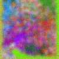
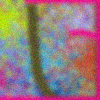
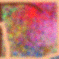
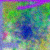
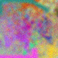
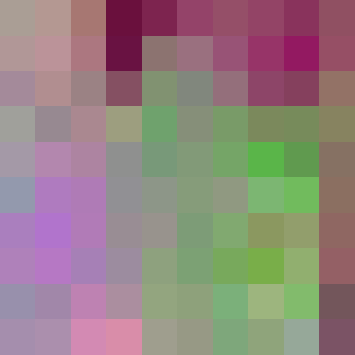

# Grades are a 1-pixel approximation to a complex picture

These days, I teach computer science to college students; for many years, I taught math to them. At the end of a semester-long course, for each student, I take everything that student has done, said, written, and so on -- all those things over the 40+ class meetings, the 15+ weeks, the submitted assignments and exams, and I output a single value -- a grade. The purpose of this, I think, is to *measure what the student learned*.

This process is fraught with profound problems, which I won't re-describe here. Instead I just want to give one way of describing these profound problems.

## What you learned this semester as a complex picture

Think of a class you've taken in school. Consider what you were like when you started that course, and when you finished it. Any meaningful, complete answer to the question "what did you learn?" seems like it must involve a dizzying array of experiences. We must somehow describe what you did and learned; what skills you developed. The new ideas, perspectives, attitudes, and beliefs you adopted or modified. The emotional associations with all those. Compare the end of the class and its beginning, and think about every single thing you can now do, or do differently, that you couldn't before.

There are so many things there, and each subtle, rich, and complex. You could barely write down a complete list of them. But any truly complex accounting of what you learned, gained, or changed ought to include all of that.

Let's commit our very first error of omission and pretend we could assign a number to each one of those things, and further that there are, say, 10,000 of them. We've already egregiously truncated the true content we are interested in; we've lost so much. But let's start from here.

Let's start, in fact, by thinking of those 10,000 numbers are describing the pixels of a 100 by 100 image:

(It's actually 400 pixels wide, but it's a scaled-up version of a 100-by-100 image so that it's easier to see.)

For a 100 by 100 image with standard 24-bit RGB color, there are a lot of possible values. Each of the 10,000 pixels can independently take any of 16,777,216 values, and there are ten thousand pixels. So each such image represents one of  167,772,160,000 possible student experiences taking the class -- 167.7 billion or so.

Here are some other images that could represent the experience of other students:

## But I need to assign a grade

Any meaningfully complete answer of "what did this student learn?" consists of one of those 167.7 billion images/values.

But the rest of the world insists on a kind of portability and legibility to my answer, and wants one of about 14 values -- A, B, C, D, plus and minus, along with D and W. (For students who withdraw -- after all, they *did* have an experience of the class.) The exact number isn't important, just that's so, so small.

I consider my students, and I see 167.7 billion answers to that question; the registrar has given me 14 to choose from. So let's try to clump together some of those values (images, experiences; however you think of it) so we have fewer things to consider. Let's shrink the image.

## 50 by 50?

Let's interpolate and downsample it to 50 by 50 -- half the size, one fourth the pixels:

There's far less information there. Fewer pixels. And the interpolation, if done well, is supposed to do a pretty good job approximating what we started with, right? Let's compare them side-by-side:

It's obvious that much has been lost. So many things about *you*, the student, and your experience that were compressed away by the algorithm as it went from the left to the right.

But even in this 50-by-50 image, there's 2500 pixels, and those 24-bit colors means there's still 41,943,040,000 possible values.

We need to keep going. Let's get serious and make it much smaller.

## 10 by 10?

Resize again down to ten by ten. Now we have:

Remember, we started with 100 by 100! Even with this, we are still confronted with 1,677,721,600 values. The registrar will only accept...14. We need to push this idea much further.

## The final output

I guess we can only have...one pixel. Here's the above 10 by 10 image,
as a single pixel:

<!-- image_a, 1x1 is (146, 133, 127) -->

*But even that isn't good enough.* Even that 1-pixel image describes one
of 16.7 million combinations of red, green, and blue. So let's
pretend...that there are only 14 colors.

Our entire world is now described by one of these colors:

The best approximation to that 1-pixel version of our original 100-by-100 image is . That's how I answer the question "what did this student learn?"

Let's recall how we got here. Compare where we started, and where we ended.

.

The left is one of 167 *billion* possible images, possible descriptions of what the student did. The right is how the school describes the student's experience, in the form of that grade.

We committed a sort of crime by ignoring so many experiences. We reduced those 167 billion descriptions to 41.9 billion. And we kept committing that crime. We sinned by omitting more and more, over and over again. Until we got to a 1-pixel version, but even though it could take on one of 16.7 million possible values, it elides so much nuance; it grossly fails to completely capture the variegated, fractal, qualitative, ineffable whatever-it-is that is "what the student learned and did in this course".

We compressed; interpolated; summarized; deleted.

## Keeping in mind what we did

The above may lead you to think that I'm intensely opposed to grades. I don't like them, but I *do* understand what they are supposed to do and why. The practical reality is that you need to take that course, that student's experience, and make it legible and portable, because we live in a complex society and many people will have no idea what that course really did, or what that student's experiences mean. In a little band of hunter-gatherers, if you wanted to know what someone else learned, or can do, you just ask around. Or probably you already know. But in our society, where we don't all know each other, just to get by we need to reduce the bandwidth needed.

Regular JPEGs work by throwing away genuine, existing data *that we can't perceive*. But what we did here threw away things about that student's experience that we *can* see and know about.

So, grades. I assign them. But I want everyone to understand what we had to do to determine those grades.

## Inspirations

This essay is very much in the same vein as Ted Chang's [ChatGPT Is a Blurry JPEG of the Web](https://www.newyorker.com/tech/annals-of-technology/chatgpt-is-a-blurry-jpeg-of-the-web).

Strangely, though, I wasn't thinking of that when I got the idea for this -- it came from reading [The Score](https://en.wikipedia.org/wiki/The_Score_(book)) by [C. Thi Nguyen](https://objectionable.net/). His work is brilliant and I highly recommend it. His [interview with NPR's Planet Money](https://www.npr.org/2026/04/21/nx-s1-5790805/how-we-all-potentially-lose-with-institutional-metrics-pm) was great, and in turn led me to two great books:

*Trust in Numbers: The Pursuit of Objectivity in Science and Public Life* by Theodore Porter, and
*All Data Are Local: Thinking Critically in a Data-Driven Society* by Yanni Loukissas. Both really give you a sense for this process of taking complex, nuanced things and squeezing them down into something legible, portable, and simple. Sometimes that's okay, but all too often it's not.

For more on how computer scientists view the problems with grades: Jordan Freitas wrote a pretty compelling piece for ITiCSE 2025: [Grades are Bugs](https://dl.acm.org/doi/10.1145/3724363.3729071). Grades are a form of legacy code, she argues, that are riddled with syntax, runtime, and semantic bugs.

For a start on the problems with grades, see Josh Eyler's *Failing Our Future*, and so many other related books in the alternative grading space, as well as so many writings by [Robert Talbert](https://www.rtalbert.org/).

The 14 colors above were inspired by the 20-ish ones at <https://sashamaps.net/docs/resources/20-colors/>.

## Comments welcome!

At the moment this is really a kind of draft of a real essay. Let me know what you think!

Dan Drake [`drake3@stolaf.edu`](mailto:drake3@stolaf.edu) • [mathstodon](https://mathstodon.xyz/@ddrake)
